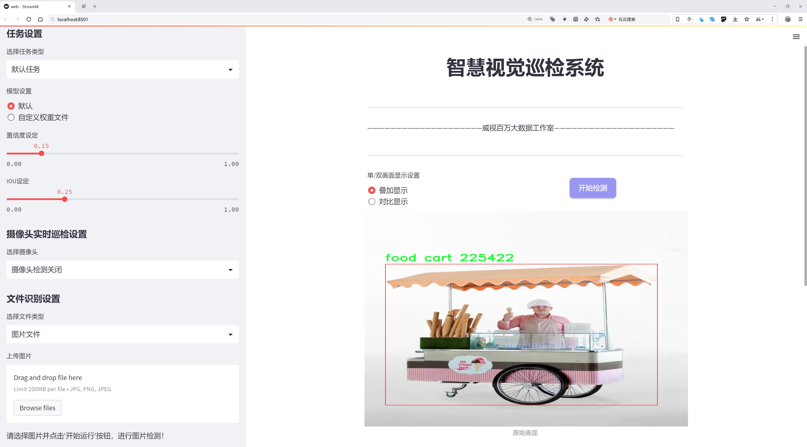

# 街头摊贩检测检测系统源码分享
 # [一条龙教学YOLOV8标注好的数据集一键训练_70+全套改进创新点发刊_Web前端展示]

### 1.研究背景与意义

项目参考[AAAI Association for the Advancement of Artificial Intelligence](https://gitee.com/qunmasj/projects)

项目来源[AACV Association for the Advancement of Computer Vision](https://kdocs.cn/l/cszuIiCKVNis)

研究背景与意义

随着城市化进程的加快，街头摊贩作为城市经济的重要组成部分，逐渐受到社会各界的关注。街头摊贩不仅为市民提供了便捷的消费选择，还在一定程度上促进了地方经济的发展。然而，街头摊贩的管理与规范化却面临诸多挑战，尤其是在城市交通、公共安全和市容市貌等方面。因此，建立一个高效的街头摊贩检测系统，能够为城市管理者提供实时、准确的数据支持，具有重要的现实意义。

近年来，计算机视觉技术的快速发展为街头摊贩的检测与识别提供了新的解决方案。YOLO（You Only Look Once）系列模型因其高效的实时检测能力，已成为目标检测领域的主流方法。YOLOv8作为该系列的最新版本，结合了深度学习的先进技术，能够在复杂环境中实现高精度的目标检测。然而，针对街头摊贩这一特定场景，YOLOv8的应用仍需进行一定的改进与优化，以提高其在实际应用中的准确性和鲁棒性。

本研究旨在基于改进的YOLOv8模型，构建一个高效的街头摊贩检测系统。为此，我们将使用包含3000张图像的街头摊贩数据集，该数据集涵盖了四类主要的街头摊贩：食品车、亭子、市场摊位和流动商店。这些类别的多样性为模型的训练提供了丰富的样本，有助于提升模型对不同类型摊贩的识别能力。同时，数据集的构建与标注过程也为后续的研究提供了良好的基础，确保了数据的质量与代表性。

通过对YOLOv8模型的改进，我们将重点关注以下几个方面：首先，优化模型的特征提取能力，以适应街头摊贩在不同光照、天气和背景下的变化；其次，增强模型的实时检测能力，以满足城市管理者对快速响应的需求；最后，结合深度学习与传统图像处理技术，提升模型在复杂场景下的鲁棒性。这些改进将有助于提高街头摊贩检测系统的整体性能，使其能够在实际应用中发挥更大的作用。

本研究的意义不仅在于推动计算机视觉技术在城市管理中的应用，更在于为街头摊贩的规范化管理提供科学依据。通过建立高效的检测系统，城市管理者可以实时监控街头摊贩的分布与活动情况，从而制定更加合理的管理政策，促进城市的有序发展。此外，该系统还可以为相关研究提供数据支持，推动街头经济、城市规划等领域的深入研究。

综上所述，基于改进YOLOv8的街头摊贩检测系统的研究，不仅具有重要的理论价值，也具有广泛的实际应用前景。通过这一研究，我们期望能够为城市管理提供新的思路与方法，推动城市的可持续发展。

### 2.图片演示




##### 注意：由于此博客编辑较早，上面“2.图片演示”和“3.视频演示”展示的系统图片或者视频可能为老版本，新版本在老版本的基础上升级如下：（实际效果以升级的新版本为准）

  （1）适配了YOLOV8的“目标检测”模型和“实例分割”模型，通过加载相应的权重（.pt）文件即可自适应加载模型。

  （2）支持“图片识别”、“视频识别”、“摄像头实时识别”三种识别模式。

  （3）支持“图片识别”、“视频识别”、“摄像头实时识别”三种识别结果保存导出，解决手动导出（容易卡顿出现爆内存）存在的问题，识别完自动保存结果并导出到tempDir中。

  （4）支持Web前端系统中的标题、背景图等自定义修改，后面提供修改教程。

  另外本项目提供训练的数据集和训练教程,暂不提供权重文件（best.pt）,需要您按照教程进行训练后实现图片演示和Web前端界面演示的效果。

### 3.视频演示

[3.1 视频演示](https://www.bilibili.com/video/BV152sBepEAB/)

### 4.数据集信息展示

##### 4.1 本项目数据集详细数据（类别数＆类别名）

nc: 3
names: ['food cart', 'kiosk', 'shop on wheels']


##### 4.2 本项目数据集信息介绍

数据集信息展示

在本研究中，我们使用了名为“street vendors”的数据集，以改进YOLOv8的街头摊贩检测系统。该数据集专注于街头摊贩的多样性，涵盖了三种主要类别：食品车（food cart）、小亭（kiosk）和流动商店（shop on wheels）。这些类别的选择反映了城市环境中常见的街头摊贩类型，旨在为计算机视觉模型提供丰富的训练样本，以提高其在实际应用中的检测精度和鲁棒性。

“street vendors”数据集的构建考虑到了街头摊贩的多样性和复杂性。食品车通常是移动的餐饮服务设施，提供各种美食，因其色彩鲜艳和独特的外观而容易被识别。小亭则是固定的摊位，通常设立在繁忙的街道或市场中，提供快速便捷的购物体验。流动商店则是更为灵活的摊贩形式，能够在不同地点之间移动，提供各种商品。这三种类别的结合，使得数据集能够涵盖广泛的街头摊贩场景，确保模型在不同环境下的适应性。

数据集中包含的图像经过精心挑选和标注，确保每一类摊贩都具有代表性。图像的多样性体现在不同的光照条件、天气状况和背景环境中，这些因素都会影响目标检测的效果。因此，数据集不仅仅是简单的图像集合，而是一个经过深思熟虑的训练资源，旨在模拟真实世界中街头摊贩的各种情况。

为了确保模型的训练效果，数据集还包括了不同角度和距离下的摊贩图像。这种多样性使得YOLOv8能够学习到更为复杂的特征，从而提高其在实际应用中的准确性。例如，食品车在不同的城市环境中可能会有不同的外观和布置，流动商店的商品展示也可能因地点而异。通过这种方式，模型能够更好地适应各种街头摊贩的变化，提升其识别能力。

此外，数据集的标注工作采用了高标准的质量控制流程，确保每一张图像中的摊贩类别和位置都被准确标记。这对于训练深度学习模型至关重要，因为准确的标注直接影响到模型的学习效果和最终的检测性能。我们在标注过程中还考虑到了摊贩的相对位置和遮挡情况，以帮助模型学习如何在复杂的街头环境中进行有效的目标检测。

综上所述，“street vendors”数据集为改进YOLOv8的街头摊贩检测系统提供了丰富而多样的训练资源。通过对食品车、小亭和流动商店这三类摊贩的全面覆盖，数据集不仅增强了模型的泛化能力，还提升了其在真实世界应用中的实用性。随着模型的不断训练和优化，我们期待能够在街头摊贩检测领域取得显著的进展，为城市管理和商业活动提供更为智能化的解决方案。


### 5.全套项目环境部署视频教程（零基础手把手教学）

[5.1 环境部署教程链接（零基础手把手教学）](https://www.ixigua.com/7404473917358506534?logTag=c807d0cbc21c0ef59de5)


[5.2 安装Python虚拟环境创建和依赖库安装视频教程链接（零基础手把手教学）](https://www.ixigua.com/7404474678003106304?logTag=1f1041108cd1f708b01a)

### 6.手把手YOLOV8训练视频教程（零基础小白有手就能学会）

[6.1 手把手YOLOV8训练视频教程（零基础小白有手就能学会）](https://www.ixigua.com/7404477157818401292?logTag=d31a2dfd1983c9668658)

### 7.70+种全套YOLOV8创新点代码加载调参视频教程（一键加载写好的改进模型的配置文件）

[7.1 70+种全套YOLOV8创新点代码加载调参视频教程（一键加载写好的改进模型的配置文件）](https://www.ixigua.com/7404478314661806627?logTag=29066f8288e3f4eea3a4)

### 8.70+种全套YOLOV8创新点原理讲解（非科班也可以轻松写刊发刊，V10版本正在科研待更新）

由于篇幅限制，每个创新点的具体原理讲解就不一一展开，具体见下列网址中的创新点对应子项目的技术原理博客网址【Blog】：


[8.1 70+种全套YOLOV8创新点原理讲解链接](https://gitee.com/qunmasj/good)

### 9.系统功能展示（检测对象为举例，实际内容以本项目数据集为准）

图9.1.系统支持检测结果表格显示

  图9.2.系统支持置信度和IOU阈值手动调节

  图9.3.系统支持自定义加载权重文件best.pt(需要你通过步骤5中训练获得)

  图9.4.系统支持摄像头实时识别

  图9.5.系统支持图片识别

  图9.6.系统支持视频识别

  图9.7.系统支持识别结果文件自动保存

  图9.8.系统支持Excel导出检测结果数据


### 10.原始YOLOV8算法原理

原始YOLOv8算法原理

YOLOv8作为YOLO系列的最新版本，承载着目标检测领域的诸多创新与进步。其设计理念是为了在快速、准确和易用性之间取得平衡，使其在各种任务中表现出色。YOLOv8的架构由三个主要部分组成：输入端（Input）、主干网络（Backbone）和检测端（Head），每个部分都经过精心设计，以优化性能和提高检测精度。

在输入端，YOLOv8默认接受640x640的图像尺寸，然而在实际应用中，图像的长宽比往往各不相同。为了解决这一问题，YOLOv8采用了自适应图片缩放技术。在测试或推理阶段，算法会将图像的长边按比例缩小到指定尺寸，并对短边进行填充。这种方法不仅减少了填充带来的信息冗余，还提高了目标检测的速度和准确性。此外，在训练过程中，YOLOv8引入了Mosaic图像增强技术。该技术通过随机选择四张图像，进行缩放和拼接，生成新的训练样本。这种增强方式使得模型能够学习到更多的位置信息和不同的像素分布，从而有效提升了预测精度。

主干网络部分是YOLOv8的一大亮点。与之前的YOLO版本相比，YOLOv8在此部分进行了重要的改进。具体而言，YOLOv8借鉴了YOLOv7中的ELAN模块的设计思想，将YOLOv5中的C3模块替换为C2F模块。C2F模块通过并行更多的梯度流分支，增强了模型的特征提取能力，同时保持了轻量化的优势。这种设计不仅提升了模型的精度，还降低了延迟，使得YOLOv8在实时检测任务中表现得更加出色。

在Neck部分，YOLOv8对特征融合的方式进行了优化。YOLOv5中的Neck结构包含了多次上采样和卷积操作，而YOLOv8则简化了这一过程，直接对主干网络不同阶段输出的特征进行上采样。这种简化不仅减少了计算量，还提高了特征融合的效率，使得模型能够更快地处理输入数据。

YOLOv8的Head部分是其最显著的创新之一。与以往的Coupled-Head结构不同，YOLOv8采用了Decoupled-Head结构，将分类和检测任务分开处理。具体来说，输入的特征图首先通过两个1x1的卷积模块进行降维，然后分别进行类别预测和边界框位置预测。这种解耦设计使得模型在处理复杂场景时能够更好地聚焦于不同的任务，提高了整体的检测性能。

在损失函数的设计上，YOLOv8也做出了显著的改进。它在分类分支中使用了二值交叉熵损失（BCELoss），而在边界框回归分支中则结合了分布焦点损失（DFL）和CIoU损失。这种组合的损失函数设计旨在使网络模型能够快速聚焦于标签附近的数值，从而提高检测的准确性。

此外，YOLOv8摒弃了传统的Anchor-Based方法，转而采用Anchor-Free的检测策略。这一变化使得YOLOv8在目标检测中不再依赖于预设的锚框，而是将目标检测转化为关键点检测。这种方法的优势在于，模型不需要在训练前对数据集进行锚框的聚类，因而具有更强的泛化能力和更简洁的网络结构。

YOLOv8的设计不仅是对前几代YOLO算法的延续，更是对目标检测领域的深刻理解与创新的体现。通过结合之前的YOLOX、YOLOv6、YOLOv7和PP-YOLOE等算法的优点，YOLOv8在性能和灵活性上都达到了新的高度。其高精度和快速的检测能力，使得YOLOv8在实际应用中展现出巨大的潜力，尤其是在复杂场景下的目标检测任务中。

总之，YOLOv8的原始算法原理是一个复杂而精妙的系统，涵盖了输入处理、特征提取、特征融合和目标检测等多个方面的创新。其设计理念不仅关注算法的准确性和速度，更强调了模型的易用性和灵活性，使得YOLOv8成为了目标检测领域的一款强大工具。随着技术的不断进步，YOLOv8无疑将在未来的研究和应用中发挥更为重要的作用。


### 11.项目核心源码讲解（再也不用担心看不懂代码逻辑）

#### 11.1 70+种YOLOv8算法改进源码大全和调试加载训练教程（非必要）\ultralytics\data\augment.py

以下是对代码中最核心部分的提取和详细中文注释：

```python
class BaseTransform:
    """
    图像变换的基类。

    该类是一个通用的变换类，可以扩展以满足特定的图像处理需求。
    该类旨在与分类和语义分割任务兼容。

    方法：
        __init__: 初始化BaseTransform对象。
        apply_image: 对标签应用图像变换。
        apply_instances: 对标签中的对象实例应用变换。
        apply_semantic: 对图像应用语义分割变换。
        __call__: 对图像、实例和语义掩码应用所有标签变换。
    """

    def __init__(self) -> None:
        """初始化BaseTransform对象。"""
        pass

    def apply_image(self, labels):
        """对标签应用图像变换。"""
        pass

    def apply_instances(self, labels):
        """对标签中的对象实例应用变换。"""
        pass

    def apply_semantic(self, labels):
        """对图像应用语义分割变换。"""
        pass

    def __call__(self, labels):
        """对图像、实例和语义掩码应用所有标签变换。"""
        self.apply_image(labels)
        self.apply_instances(labels)
        self.apply_semantic(labels)


class Mosaic(BaseMixTransform):
    """
    马赛克增强。

    该类通过将多个（4或9）图像组合成一个马赛克图像来执行马赛克增强。
    增强以给定的概率应用于数据集。

    属性：
        dataset: 应用马赛克增强的数据集。
        imgsz (int, optional): 单个图像的马赛克管道后的图像大小（高度和宽度）。默认为640。
        p (float, optional): 应用马赛克增强的概率。必须在0-1范围内。默认为1.0。
        n (int, optional): 网格大小，4（2x2）或9（3x3）。
    """

    def __init__(self, dataset, imgsz=640, p=1.0, n=4):
        """使用数据集、图像大小、概率和边界初始化对象。"""
        assert 0 <= p <= 1.0, f'概率应在[0, 1]范围内，但得到{p}。'
        assert n in (4, 9), '网格必须等于4或9。'
        super().__init__(dataset=dataset, p=p)
        self.dataset = dataset
        self.imgsz = imgsz
        self.border = (-imgsz // 2, -imgsz // 2)  # 宽度，高度
        self.n = n

    def get_indexes(self, buffer=True):
        """返回数据集中随机索引的列表。"""
        if buffer:  # 从缓冲区选择图像
            return random.choices(list(self.dataset.buffer), k=self.n - 1)
        else:  # 选择任何图像
            return [random.randint(0, len(self.dataset) - 1) for _ in range(self.n - 1)]

    def _mix_transform(self, labels):
        """对标签字典应用MixUp或Mosaic增强。"""
        assert labels.get('rect_shape', None) is None, 'rect和mosaic是互斥的。'
        assert len(labels.get('mix_labels', [])), '没有其他图像用于马赛克增强。'
        return self._mosaic4(labels) if self.n == 4 else self._mosaic9(labels)

    def _mosaic4(self, labels):
        """创建2x2图像马赛克。"""
        mosaic_labels = []
        s = self.imgsz
        yc, xc = (int(random.uniform(-x, 2 * s + x)) for x in self.border)  # 马赛克中心x, y
        for i in range(4):
            labels_patch = labels if i == 0 else labels['mix_labels'][i - 1]
            img = labels_patch['img']
            h, w = labels_patch.pop('resized_shape')

            # 将图像放置在img4中
            if i == 0:  # 左上角
                img4 = np.full((s * 2, s * 2, img.shape[2]), 114, dtype=np.uint8)  # 用4个切片的基础图像
                x1a, y1a, x2a, y2a = max(xc - w, 0), max(yc - h, 0), xc, yc  # 大图像的xmin, ymin, xmax, ymax
                x1b, y1b, x2b, y2b = w - (x2a - x1a), h - (y2a - y1a), w, h  # 小图像的xmin, ymin, xmax, ymax
            # 其他位置的处理省略...

            img4[y1a:y2a, x1a:x2a] = img[y1b:y2b, x1b:x2b]  # img4[ymin:ymax, xmin:xmax]
            padw = x1a - x1b
            padh = y1a - y1b

            labels_patch = self._update_labels(labels_patch, padw, padh)
            mosaic_labels.append(labels_patch)
        final_labels = self._cat_labels(mosaic_labels)
        final_labels['img'] = img4
        return final_labels

    # 其他方法省略...

class RandomPerspective:
    """
    实现随机透视和仿射变换。

    这些变换包括旋转、平移、缩放和剪切。
    """

    def __init__(self, degrees=0.0, translate=0.1, scale=0.5, shear=0.0, perspective=0.0, border=(0, 0), pre_transform=None):
        """初始化RandomPerspective对象，设置变换参数。"""
        self.degrees = degrees
        self.translate = translate
        self.scale = scale
        self.shear = shear
        self.perspective = perspective
        self.border = border  # 马赛克边界
        self.pre_transform = pre_transform

    def __call__(self, labels):
        """对图像和目标应用仿射变换。"""
        if self.pre_transform and 'mosaic_border' not in labels:
            labels = self.pre_transform(labels)
        labels.pop('ratio_pad', None)  # 不需要比例填充

        img = labels['img']
        instances = labels.pop('instances')
        instances.convert_bbox(format='xyxy')
        instances.denormalize(*img.shape[:2][::-1])

        border = labels.pop('mosaic_border', self.border)
        self.size = img.shape[1] + border[1] * 2, img.shape[0] + border[0] * 2  # w, h
        img, M, scale = self.affine_transform(img, border)

        bboxes = self.apply_bboxes(instances.bboxes, M)
        segments = instances.segments
        keypoints = instances.keypoints

        if len(segments):
            bboxes, segments = self.apply_segments(segments, M)

        if keypoints is not None:
            keypoints = self.apply_keypoints(keypoints, M)
        new_instances = Instances(bboxes, segments, keypoints, bbox_format='xyxy', normalized=False)
        new_instances.clip(*self.size)

        # 过滤实例
        instances.scale(scale_w=scale, scale_h=scale, bbox_only=True)
        labels['instances'] = new_instances
        labels['img'] = img
        labels['resized_shape'] = img.shape[:2]
        return labels

# 其他类和方法省略...
```

以上代码片段展示了几个核心类及其方法，包括图像变换的基类 `BaseTransform`、马赛克增强的实现 `Mosaic` 和随机透视变换的实现 `RandomPerspective`。每个类和方法都附有详细的中文注释，解释其功能和用途。

这个文件是YOLOv8算法中的数据增强模块，主要用于对图像进行各种变换和增强，以提高模型的鲁棒性和泛化能力。文件中定义了多个类，每个类负责不同类型的图像增强操作。

首先，`BaseTransform`类是一个基类，提供了图像变换的基本结构，包含了初始化方法和应用图像、实例和语义分割标签的方法。这个类可以被其他具体的变换类继承和扩展。

接下来，`Compose`类用于将多个图像变换组合在一起，允许用户按顺序应用一系列变换。它提供了调用方法来依次执行每个变换，并可以动态添加新的变换。

`BaseMixTransform`类是一个用于混合增强（如MixUp和Mosaic）的基类。它的构造函数接收数据集、预处理变换和应用概率。该类的主要功能是从数据集中随机选择图像，并将其与当前图像进行混合。

`Mosaic`类继承自`BaseMixTransform`，实现了马赛克增强的功能。它可以将多个图像（通常是4或9个）组合成一个马赛克图像。该类包含了获取随机索引、混合变换的具体实现等方法。

`MixUp`类同样继承自`BaseMixTransform`，实现了MixUp增强的功能。它通过将两张图像进行加权平均来生成新的图像，并更新相应的标签。

`RandomPerspective`类实现了随机透视变换，能够对图像及其对应的边界框、分割和关键点进行旋转、平移、缩放和剪切等变换。该类提供了多个参数以控制变换的程度，并包含了应用变换的方法。

`RandomHSV`类负责对图像的色调、饱和度和亮度进行随机调整，以增强图像的色彩多样性。

`RandomFlip`类实现了随机翻转图像的功能，可以选择水平或垂直翻转，并相应地更新边界框和关键点。

`LetterBox`类用于调整图像大小并进行填充，以适应目标检测、实例分割和姿态估计任务。它通过计算填充量来保持图像的长宽比，并在图像周围添加边框。

`CopyPaste`类实现了图像的复制粘贴增强，能够将图像中的某些实例复制到其他位置，以增加数据的多样性。

`Albumentations`类提供了一系列额外的图像增强操作，利用外部库`albumentations`实现，包括模糊、对比度自适应直方图均衡化等。

最后，`Format`类用于格式化图像注释，以便在PyTorch的DataLoader中使用。它标准化图像和实例注释的格式，确保在训练和评估时的一致性。

文件末尾的`v8_transforms`和`classify_transforms`函数用于生成适合YOLOv8训练的图像变换序列，提供了灵活的参数配置以满足不同的训练需求。整体而言，这个文件为YOLOv8提供了强大的数据增强能力，帮助模型在各种情况下表现更好。

#### 11.2 70+种YOLOv8算法改进源码大全和调试加载训练教程（非必要）\ultralytics\utils\callbacks\dvc.py

以下是经过简化和注释的核心代码部分，保留了主要功能，并对每个函数进行了详细的中文注释：

```python
# 导入必要的库
from ultralytics.utils import LOGGER, SETTINGS, TESTS_RUNNING, checks

try:
    # 确保当前不是在测试环境中
    assert not TESTS_RUNNING  
    # 确保DVC集成已启用
    assert SETTINGS['dvc'] is True  
    import dvclive  # 导入DVC Live库
    # 检查DVC Live的版本
    assert checks.check_version('dvclive', '2.11.0', verbose=True)

    import os
    import re
    from pathlib import Path

    # 创建DVC Live日志实例
    live = None
    _processed_plots = {}  # 存储已处理的图表

    # 训练周期标志，指示当前是否在训练周期中
    _training_epoch = False

except (ImportError, AssertionError, TypeError):
    dvclive = None  # 如果导入失败，设置dvclive为None


def _log_images(path, prefix=''):
    """记录指定路径的图像，使用可选的前缀和DVC Live进行日志记录。"""
    if live:  # 如果DVC Live实例存在
        name = path.name
        # 根据批次分组图像，以便在UI中启用滑块
        m = re.search(r'_batch(\d+)', name)
        if m:
            ni = m[1]
            new_stem = re.sub(r'_batch(\d+)', '_batch', path.stem)
            name = (Path(new_stem) / ni).with_suffix(path.suffix)

        live.log_image(os.path.join(prefix, name), path)  # 记录图像


def _log_plots(plots, prefix=''):
    """记录训练进度的图像，如果它们尚未被处理。"""
    for name, params in plots.items():
        timestamp = params['timestamp']
        if _processed_plots.get(name) != timestamp:  # 检查图表是否已处理
            _log_images(name, prefix)  # 记录图像
            _processed_plots[name] = timestamp  # 更新已处理图表的时间戳


def on_pretrain_routine_start(trainer):
    """在预训练例程开始时初始化DVC Live日志记录器。"""
    try:
        global live
        live = dvclive.Live(save_dvc_exp=True, cache_images=True)  # 创建DVC Live实例
        LOGGER.info("DVCLive is detected and auto logging is enabled.")  # 记录信息
    except Exception as e:
        LOGGER.warning(f'WARNING ⚠️ DVCLive installed but not initialized correctly: {e}')  # 记录警告


def on_train_start(trainer):
    """如果DVC Live日志记录处于活动状态，则记录训练参数。"""
    if live:
        live.log_params(trainer.args)  # 记录训练参数


def on_fit_epoch_end(trainer):
    """在每个训练周期结束时记录训练指标和模型信息。"""
    global _training_epoch
    if live and _training_epoch:  # 如果DVC Live实例存在且在训练周期中
        all_metrics = {**trainer.label_loss_items(trainer.tloss, prefix='train'), **trainer.metrics, **trainer.lr}
        for metric, value in all_metrics.items():
            live.log_metric(metric, value)  # 记录指标

        _log_plots(trainer.plots, 'train')  # 记录训练图表
        live.next_step()  # 进入下一个步骤
        _training_epoch = False  # 重置训练周期标志


def on_train_end(trainer):
    """在训练结束时记录最佳指标、图表和混淆矩阵。"""
    if live:
        all_metrics = {**trainer.label_loss_items(trainer.tloss, prefix='train'), **trainer.metrics, **trainer.lr}
        for metric, value in all_metrics.items():
            live.log_metric(metric, value, plot=False)  # 记录最佳指标

        _log_plots(trainer.plots, 'val')  # 记录验证图表
        if trainer.best.exists():
            live.log_artifact(trainer.best, copy=True, type='model')  # 记录最佳模型

        live.end()  # 结束DVC Live日志记录


# 定义回调函数字典
callbacks = {
    'on_pretrain_routine_start': on_pretrain_routine_start,
    'on_train_start': on_train_start,
    'on_fit_epoch_end': on_fit_epoch_end,
    'on_train_end': on_train_end
} if dvclive else {}
```

### 代码说明：
1. **导入库**：导入了Ultralytics和DVC Live所需的库。
2. **异常处理**：在导入DVC Live时，使用`try-except`块来处理可能的导入错误。
3. **日志记录函数**：
   - `_log_images`：记录图像到DVC Live。
   - `_log_plots`：记录训练和验证过程中的图表。
4. **回调函数**：
   - `on_pretrain_routine_start`：在预训练开始时初始化DVC Live。
   - `on_train_start`：记录训练参数。
   - `on_fit_epoch_end`：在每个训练周期结束时记录指标和图表。
   - `on_train_end`：在训练结束时记录最佳指标和模型。

通过这些核心部分和注释，代码的功能和结构变得更加清晰。

这个程序文件是一个用于YOLO（You Only Look Once）算法的训练过程中的回调函数实现，主要与DVCLive库集成，以便在训练过程中记录和可视化训练的相关信息。文件中首先导入了一些必要的模块和库，并进行了一些初步的检查，以确保DVCLive的集成已启用且版本符合要求。

在代码中，定义了一个全局变量`live`，用于存储DVCLive的实例，以及一个字典`_processed_plots`，用于跟踪已经处理过的绘图数据。接下来，定义了一些私有函数，例如`_log_images`、`_log_plots`和`_log_confusion_matrix`，这些函数分别用于记录图像、绘图和混淆矩阵的日志信息。

`on_pretrain_routine_start`和`on_pretrain_routine_end`函数在预训练例程开始和结束时被调用，分别用于初始化DVCLive日志记录器和记录训练过程中的绘图信息。`on_train_start`函数在训练开始时记录训练参数，而`on_train_epoch_start`函数则在每个训练周期开始时设置一个全局变量，以指示当前正在进行训练。

`on_fit_epoch_end`函数在每个训练周期结束时被调用，用于记录训练指标和模型信息，并推进到下一个步骤。最后，`on_train_end`函数在训练结束时记录最佳指标、绘图和混淆矩阵，并结束DVCLive的记录。

整个文件的最后部分定义了一个回调字典`callbacks`，其中包含了所有的回调函数，如果DVCLive未激活，则该字典为空。通过这些回调函数，用户可以在训练过程中实时监控模型的性能和进展，从而更好地调整和优化训练过程。

#### 11.3 ui.py

```python
import sys
import subprocess

def run_script(script_path):
    """
    使用当前 Python 环境运行指定的脚本。

    Args:
        script_path (str): 要运行的脚本路径

    Returns:
        None
    """
    # 获取当前 Python 解释器的路径
    python_path = sys.executable

    # 构建运行命令，使用 streamlit 运行指定的脚本
    command = f'"{python_path}" -m streamlit run "{script_path}"'

    # 执行命令并等待其完成
    result = subprocess.run(command, shell=True)
    
    # 检查命令执行的返回码，如果不为0，表示出错
    if result.returncode != 0:
        print("脚本运行出错。")


# 实例化并运行应用
if __name__ == "__main__":
    # 指定要运行的脚本路径
    script_path = "web.py"  # 假设脚本在当前目录下

    # 调用函数运行脚本
    run_script(script_path)
```

### 代码注释说明：
1. **导入模块**：
   - `sys`：用于访问与 Python 解释器相关的变量和函数。
   - `subprocess`：用于创建新进程、连接到它们的输入/输出/错误管道，并获得它们的返回码。

2. **定义 `run_script` 函数**：
   - 此函数接受一个参数 `script_path`，表示要运行的 Python 脚本的路径。
   - 使用 `sys.executable` 获取当前 Python 解释器的路径，以确保使用相同的环境来运行脚本。
   - 构建一个命令字符串，使用 `streamlit` 模块运行指定的脚本。
   - 使用 `subprocess.run` 执行命令，并等待其完成。
   - 检查返回码，如果不为0，打印错误信息。

3. **主程序入口**：
   - 在 `if __name__ == "__main__":` 块中，指定要运行的脚本路径（此处假设为 `web.py`）。
   - 调用 `run_script` 函数来执行该脚本。

这个程序文件的主要功能是使用当前的 Python 环境来运行一个指定的脚本，具体来说是运行一个名为 `web.py` 的脚本。首先，程序导入了必要的模块，包括 `sys`、`os` 和 `subprocess`，这些模块提供了与系统交互的功能。特别是 `subprocess` 模块用于在 Python 中执行外部命令。

在 `run_script` 函数中，首先获取当前 Python 解释器的路径，这通过 `sys.executable` 实现。接着，构建一个命令字符串，这个命令用于运行 `streamlit`，并指定要执行的脚本路径。这里使用了 `-m streamlit run` 的方式来运行 Streamlit 应用。

然后，使用 `subprocess.run` 方法执行构建好的命令。如果命令执行的返回码不为零，表示脚本运行出错，程序会打印出相应的错误信息。

在文件的最后部分，使用 `if __name__ == "__main__":` 语句来确保只有在直接运行该文件时才会执行后面的代码。这里指定了要运行的脚本路径为 `web.py`，并调用 `run_script` 函数来执行这个脚本。

总的来说，这个程序的目的是提供一个简单的接口来运行 Streamlit 应用，方便用户在当前 Python 环境中启动指定的脚本。

#### 11.4 70+种YOLOv8算法改进源码大全和调试加载训练教程（非必要）\ultralytics\utils\tal.py

以下是代码中最核心的部分，并附上详细的中文注释：

```python
import torch
import torch.nn as nn

def select_candidates_in_gts(xy_centers, gt_bboxes, eps=1e-9):
    """
    从真实框中选择正样本的锚点中心。

    参数:
        xy_centers (Tensor): 形状为(h*w, 2)的张量，表示锚点的中心坐标。
        gt_bboxes (Tensor): 形状为(b, n_boxes, 4)的张量，表示真实框的坐标。

    返回:
        (Tensor): 形状为(b, n_boxes, h*w)的张量，表示每个真实框中是否包含锚点中心。
    """
    n_anchors = xy_centers.shape[0]  # 锚点数量
    bs, n_boxes, _ = gt_bboxes.shape  # 批次大小和真实框数量
    lt, rb = gt_bboxes.view(-1, 1, 4).chunk(2, 2)  # 将真实框分为左上角和右下角
    bbox_deltas = torch.cat((xy_centers[None] - lt, rb - xy_centers[None]), dim=2).view(bs, n_boxes, n_anchors, -1)
    return bbox_deltas.amin(3).gt_(eps)  # 返回每个锚点是否在真实框内的布尔值

class TaskAlignedAssigner(nn.Module):
    """
    任务对齐分配器，用于目标检测。

    该类根据任务对齐度量将真实对象分配给锚点，结合了分类和定位信息。

    属性:
        topk (int): 考虑的前k个候选框数量。
        num_classes (int): 目标类别数量。
        alpha (float): 分类组件的alpha参数。
        beta (float): 定位组件的beta参数。
        eps (float): 防止除以零的小值。
    """

    def __init__(self, topk=13, num_classes=80, alpha=1.0, beta=6.0, eps=1e-9):
        """初始化任务对齐分配器对象，设置可调超参数。"""
        super().__init__()
        self.topk = topk
        self.num_classes = num_classes
        self.bg_idx = num_classes  # 背景类别索引
        self.alpha = alpha
        self.beta = beta
        self.eps = eps

    @torch.no_grad()
    def forward(self, pd_scores, pd_bboxes, anc_points, gt_labels, gt_bboxes, mask_gt):
        """
        计算任务对齐分配。

        参数:
            pd_scores (Tensor): 形状为(bs, num_total_anchors, num_classes)的张量，表示预测的得分。
            pd_bboxes (Tensor): 形状为(bs, num_total_anchors, 4)的张量，表示预测的边界框。
            anc_points (Tensor): 形状为(num_total_anchors, 2)的张量，表示锚点坐标。
            gt_labels (Tensor): 形状为(bs, n_max_boxes, 1)的张量，表示真实框的标签。
            gt_bboxes (Tensor): 形状为(bs, n_max_boxes, 4)的张量，表示真实框的坐标。
            mask_gt (Tensor): 形状为(bs, n_max_boxes, 1)的张量，表示真实框的掩码。

        返回:
            target_labels (Tensor): 形状为(bs, num_total_anchors)的张量，表示目标标签。
            target_bboxes (Tensor): 形状为(bs, num_total_anchors, 4)的张量，表示目标边界框。
            target_scores (Tensor): 形状为(bs, num_total_anchors, num_classes)的张量，表示目标得分。
            fg_mask (Tensor): 形状为(bs, num_total_anchors)的布尔张量，表示前景锚点。
            target_gt_idx (Tensor): 形状为(bs, num_total_anchors)的张量，表示目标真实框索引。
        """
        self.bs = pd_scores.size(0)  # 批次大小
        self.n_max_boxes = gt_bboxes.size(1)  # 最大真实框数量

        if self.n_max_boxes == 0:
            device = gt_bboxes.device
            return (torch.full_like(pd_scores[..., 0], self.bg_idx).to(device), 
                    torch.zeros_like(pd_bboxes).to(device),
                    torch.zeros_like(pd_scores).to(device), 
                    torch.zeros_like(pd_scores[..., 0]).to(device),
                    torch.zeros_like(pd_scores[..., 0]).to(device))

        mask_pos, align_metric, overlaps = self.get_pos_mask(pd_scores, pd_bboxes, gt_labels, gt_bboxes, anc_points, mask_gt)

        target_gt_idx, fg_mask, mask_pos = select_highest_overlaps(mask_pos, overlaps, self.n_max_boxes)

        # 计算目标标签、边界框和得分
        target_labels, target_bboxes, target_scores = self.get_targets(gt_labels, gt_bboxes, target_gt_idx, fg_mask)

        # 归一化对齐度量
        align_metric *= mask_pos
        pos_align_metrics = align_metric.amax(dim=-1, keepdim=True)  # b, max_num_obj
        pos_overlaps = (overlaps * mask_pos).amax(dim=-1, keepdim=True)  # b, max_num_obj
        norm_align_metric = (align_metric * pos_overlaps / (pos_align_metrics + self.eps)).amax(-2).unsqueeze(-1)
        target_scores = target_scores * norm_align_metric

        return target_labels, target_bboxes, target_scores, fg_mask.bool(), target_gt_idx

    def get_pos_mask(self, pd_scores, pd_bboxes, gt_labels, gt_bboxes, anc_points, mask_gt):
        """获取正样本掩码，形状为(b, max_num_obj, h*w)。"""
        mask_in_gts = select_candidates_in_gts(anc_points, gt_bboxes)  # 获取锚点在真实框内的掩码
        align_metric, overlaps = self.get_box_metrics(pd_scores, pd_bboxes, gt_labels, gt_bboxes, mask_in_gts * mask_gt)  # 计算对齐度量和重叠度
        mask_topk = self.select_topk_candidates(align_metric, topk_mask=mask_gt.expand(-1, -1, self.topk).bool())  # 选择前k个候选
        mask_pos = mask_topk * mask_in_gts * mask_gt  # 合并所有掩码

        return mask_pos, align_metric, overlaps

    def get_box_metrics(self, pd_scores, pd_bboxes, gt_labels, gt_bboxes, mask_gt):
        """计算给定预测和真实边界框的对齐度量。"""
        na = pd_bboxes.shape[-2]  # 锚点数量
        mask_gt = mask_gt.bool()  # 转换为布尔类型
        overlaps = torch.zeros([self.bs, self.n_max_boxes, na], dtype=pd_bboxes.dtype, device=pd_bboxes.device)  # 初始化重叠度张量
        bbox_scores = torch.zeros([self.bs, self.n_max_boxes, na], dtype=pd_scores.dtype, device=pd_scores.device)  # 初始化边界框得分张量

        ind = torch.zeros([2, self.bs, self.n_max_boxes], dtype=torch.long)  # 初始化索引张量
        ind[0] = torch.arange(end=self.bs).view(-1, 1).expand(-1, self.n_max_boxes)  # 批次索引
        ind[1] = gt_labels.squeeze(-1)  # 真实框标签索引
        bbox_scores[mask_gt] = pd_scores[ind[0], :, ind[1]][mask_gt]  # 获取每个锚点的得分

        # 计算重叠度
        pd_boxes = pd_bboxes.unsqueeze(1).expand(-1, self.n_max_boxes, -1, -1)[mask_gt]  # 扩展预测边界框
        gt_boxes = gt_bboxes.unsqueeze(2).expand(-1, -1, na, -1)[mask_gt]  # 扩展真实边界框
        overlaps[mask_gt] = bbox_iou(gt_boxes, pd_boxes, xywh=False, CIoU=True).squeeze(-1).clamp_(0)  # 计算IoU

        align_metric = bbox_scores.pow(self.alpha) * overlaps.pow(self.beta)  # 计算对齐度量
        return align_metric, overlaps

    def get_targets(self, gt_labels, gt_bboxes, target_gt_idx, fg_mask):
        """
        计算正样本锚点的目标标签、目标边界框和目标得分。

        参数:
            gt_labels (Tensor): 真实框标签，形状为(b, max_num_obj, 1)。
            gt_bboxes (Tensor): 真实框边界框，形状为(b, max_num_obj, 4)。
            target_gt_idx (Tensor): 正样本锚点分配的真实框索引，形状为(b, h*w)。
            fg_mask (Tensor): 布尔张量，形状为(b, h*w)，表示前景锚点。

        返回:
            (Tuple[Tensor, Tensor, Tensor]): 包含目标标签、目标边界框和目标得分的元组。
        """
        batch_ind = torch.arange(end=self.bs, dtype=torch.int64, device=gt_labels.device)[..., None]
        target_gt_idx = target_gt_idx + batch_ind * self.n_max_boxes  # 计算目标真实框索引
        target_labels = gt_labels.long().flatten()[target_gt_idx]  # 获取目标标签

        target_bboxes = gt_bboxes.view(-1, 4)[target_gt_idx]  # 获取目标边界框
        target_labels.clamp_(0)  # 限制标签值在有效范围内

        # 计算目标得分
        target_scores = torch.zeros((target_labels.shape[0], target_labels.shape[1], self.num_classes),
                                    dtype=torch.int64,
                                    device=target_labels.device)  # 初始化目标得分张量
        target_scores.scatter_(2, target_labels.unsqueeze(-1), 1)  # 根据目标标签填充得分

        fg_scores_mask = fg_mask[:, :, None].repeat(1, 1, self.num_classes)  # 扩展前景掩码
        target_scores = torch.where(fg_scores_mask > 0, target_scores, 0)  # 仅保留前景得分

        return target_labels, target_bboxes, target_scores
```

以上代码是YOLO目标检测中的任务对齐分配器的核心部分。它通过计算预测框与真实框之间的重叠度和对齐度量，来为每个锚点分配真实框，并生成相应的目标标签、边界框和得分。代码中的注释详细解释了每个函数的作用、输入输出及其逻辑。

这个程序文件是一个用于YOLOv8目标检测算法的工具模块，主要实现了与目标分配和锚框生成相关的功能。代码中使用了PyTorch库，定义了一些用于处理目标检测任务的类和函数。

首先，文件导入了必要的库，包括PyTorch的核心模块和一些自定义的工具函数，如版本检查和度量计算。接着，定义了一个函数`select_candidates_in_gts`，该函数用于从给定的锚框中心和真实框中选择正样本锚框。它通过计算锚框中心与真实框的距离，返回一个布尔张量，指示哪些锚框是正样本。

接下来，定义了另一个函数`select_highest_overlaps`，用于在一个锚框被多个真实框分配的情况下，选择与真实框重叠度最高的锚框。它返回目标真实框的索引、前景掩码和经过处理的掩码。

然后，定义了一个名为`TaskAlignedAssigner`的类，这是一个用于目标检测的任务对齐分配器。该类的构造函数接受一些超参数，如考虑的候选框数量、类别数量、分类和定位的权重等。在`forward`方法中，该类计算任务对齐的分配，包括获取正样本掩码、计算目标标签、边界框和分数等。

在`get_pos_mask`方法中，首先通过调用`select_candidates_in_gts`函数获取锚框与真实框的匹配情况，然后计算对齐度量和重叠度，最后合并所有掩码以得到最终的正样本掩码。

`get_box_metrics`方法用于计算给定预测框和真实框之间的对齐度量，返回对齐度量和重叠度。`select_topk_candidates`方法根据给定的度量选择前k个候选框。

`get_targets`方法则计算正样本锚框的目标标签、目标边界框和目标分数。它通过索引将真实框的标签和边界框映射到正样本锚框上，并生成相应的目标分数。

此外，文件中还定义了几个辅助函数，如`make_anchors`用于生成锚框，`dist2bbox`和`bbox2dist`用于在锚框和边界框之间进行转换。这些函数为目标检测任务提供了必要的支持，确保模型能够有效地进行训练和推理。

整体来看，这个文件的主要功能是实现目标检测中锚框的生成和分配，通过对真实框和预测框的分析，帮助模型更好地学习目标的位置和类别信息。

#### 11.5 70+种YOLOv8算法改进源码大全和调试加载训练教程（非必要）\ultralytics\trackers\utils\matching.py

以下是经过简化和注释的核心代码部分：

```python
import numpy as np
import scipy
from scipy.spatial.distance import cdist
from ultralytics.utils.metrics import bbox_ioa

try:
    import lap  # 导入线性分配库
    assert lap.__version__  # 确保导入的库版本有效
except (ImportError, AssertionError, AttributeError):
    from ultralytics.utils.checks import check_requirements
    check_requirements('lapx>=0.5.2')  # 检查并安装所需的lap库
    import lap

def linear_assignment(cost_matrix, thresh, use_lap=True):
    """
    使用线性分配算法进行匹配。

    参数:
        cost_matrix (np.ndarray): 成本矩阵，包含分配的成本值。
        thresh (float): 认为分配有效的阈值。
        use_lap (bool, optional): 是否使用lap.lapjv算法。默认为True。

    返回:
        (tuple): 包含匹配索引、未匹配的索引（来自'a'）和未匹配的索引（来自'b'）的元组。
    """
    if cost_matrix.size == 0:
        # 如果成本矩阵为空，返回空匹配和所有未匹配索引
        return np.empty((0, 2), dtype=int), tuple(range(cost_matrix.shape[0])), tuple(range(cost_matrix.shape[1]))

    if use_lap:
        # 使用lap库进行线性分配
        _, x, y = lap.lapjv(cost_matrix, extend_cost=True, cost_limit=thresh)
        matches = [[ix, mx] for ix, mx in enumerate(x) if mx >= 0]  # 生成匹配对
        unmatched_a = np.where(x < 0)[0]  # 找到未匹配的'a'索引
        unmatched_b = np.where(y < 0)[0]  # 找到未匹配的'b'索引
    else:
        # 使用scipy进行线性分配
        x, y = scipy.optimize.linear_sum_assignment(cost_matrix)  # 获取匹配的行和列索引
        matches = np.asarray([[x[i], y[i]] for i in range(len(x)) if cost_matrix[x[i], y[i]] <= thresh])
        if len(matches) == 0:
            unmatched_a = list(np.arange(cost_matrix.shape[0]))  # 所有'a'索引未匹配
            unmatched_b = list(np.arange(cost_matrix.shape[1]))  # 所有'b'索引未匹配
        else:
            unmatched_a = list(set(np.arange(cost_matrix.shape[0])) - set(matches[:, 0]))  # 计算未匹配的'a'索引
            unmatched_b = list(set(np.arange(cost_matrix.shape[1])) - set(matches[:, 1]))  # 计算未匹配的'b'索引

    return matches, unmatched_a, unmatched_b  # 返回匹配结果和未匹配索引

def iou_distance(atracks, btracks):
    """
    基于交并比（IoU）计算轨迹之间的成本。

    参数:
        atracks (list): 轨迹'a'或边界框的列表。
        btracks (list): 轨迹'b'或边界框的列表。

    返回:
        (np.ndarray): 基于IoU计算的成本矩阵。
    """
    # 如果输入是边界框，直接使用
    if (len(atracks) > 0 and isinstance(atracks[0], np.ndarray)) \
            or (len(btracks) > 0 and isinstance(btracks[0], np.ndarray)):
        atlbrs = atracks
        btlbrs = btracks
    else:
        # 提取轨迹的边界框
        atlbrs = [track.tlbr for track in atracks]
        btlbrs = [track.tlbr for track in btracks]

    ious = np.zeros((len(atlbrs), len(btlbrs)), dtype=np.float32)  # 初始化IoU矩阵
    if len(atlbrs) and len(btlbrs):
        # 计算IoU
        ious = bbox_ioa(np.ascontiguousarray(atlbrs, dtype=np.float32),
                        np.ascontiguousarray(btlbrs, dtype=np.float32),
                        iou=True)
    return 1 - ious  # 返回成本矩阵（1 - IoU）

def embedding_distance(tracks, detections, metric='cosine'):
    """
    基于嵌入计算轨迹和检测之间的距离。

    参数:
        tracks (list): 轨迹列表。
        detections (list): 检测列表。
        metric (str, optional): 距离计算的度量。默认为'cosine'。

    返回:
        (np.ndarray): 基于嵌入计算的成本矩阵。
    """
    cost_matrix = np.zeros((len(tracks), len(detections)), dtype=np.float32)  # 初始化成本矩阵
    if cost_matrix.size == 0:
        return cost_matrix  # 如果成本矩阵为空，直接返回

    det_features = np.asarray([track.curr_feat for track in detections], dtype=np.float32)  # 获取检测特征
    track_features = np.asarray([track.smooth_feat for track in tracks], dtype=np.float32)  # 获取轨迹特征
    cost_matrix = np.maximum(0.0, cdist(track_features, det_features, metric))  # 计算特征之间的距离
    return cost_matrix  # 返回成本矩阵

def fuse_score(cost_matrix, detections):
    """
    将成本矩阵与检测分数融合，生成单一相似度矩阵。

    参数:
        cost_matrix (np.ndarray): 成本矩阵。
        detections (list): 带有分数的检测列表。

    返回:
        (np.ndarray): 融合后的相似度矩阵。
    """
    if cost_matrix.size == 0:
        return cost_matrix  # 如果成本矩阵为空，直接返回

    iou_sim = 1 - cost_matrix  # 计算IoU相似度
    det_scores = np.array([det.score for det in detections])  # 获取检测分数
    det_scores = np.expand_dims(det_scores, axis=0).repeat(cost_matrix.shape[0], axis=0)  # 扩展分数维度
    fuse_sim = iou_sim * det_scores  # 融合相似度
    return 1 - fuse_sim  # 返回融合后的成本矩阵
```

### 代码说明：
1. **linear_assignment**: 该函数实现了线性分配算法，输入为成本矩阵和阈值，返回匹配结果和未匹配的索引。
2. **iou_distance**: 计算两个轨迹或边界框之间的交并比（IoU），并返回相应的成本矩阵。
3. **embedding_distance**: 计算轨迹和检测之间的距离，基于它们的嵌入特征，返回成本矩阵。
4. **fuse_score**: 将成本矩阵与检测分数结合，生成一个综合的相似度矩阵。

这个程序文件是一个用于目标跟踪的工具模块，主要实现了基于成本矩阵的线性分配、IoU（交并比）距离计算、嵌入距离计算以及融合得分等功能。文件中首先导入了必要的库，包括NumPy和SciPy，并且尝试导入一个名为`lap`的库用于线性分配。如果导入失败，则会检查并安装相应的依赖。

在`linear_assignment`函数中，输入一个成本矩阵和一个阈值，函数会根据是否使用`lap`库来选择不同的线性分配算法。该函数返回匹配的索引以及未匹配的索引，能够有效地处理空的成本矩阵情况。

`iou_distance`函数计算两个跟踪对象之间的IoU距离，输入为两个跟踪对象的列表。它会生成一个成本矩阵，表示每对跟踪对象之间的IoU值，并将其转换为成本形式（1 - IoU），因为较高的IoU表示更好的匹配。

`embedding_distance`函数则计算跟踪对象和检测对象之间的距离，基于特征嵌入的相似性。它使用余弦距离或其他指定的度量来生成成本矩阵，表示每个跟踪对象与每个检测对象之间的相似度。

最后，`fuse_score`函数将成本矩阵与检测得分融合，生成一个综合的相似度矩阵。该函数首先计算IoU相似度，然后将检测得分扩展到与成本矩阵相同的形状，最后通过相乘得到融合后的相似度矩阵。

整体而言，这个模块为目标跟踪提供了基础的匹配算法和相似度计算方法，能够在实际应用中帮助实现高效的目标跟踪。

#### 11.6 train.py

以下是经过简化和注释的核心代码部分：

```python
import random
import numpy as np
import torch.nn as nn
from ultralytics.data import build_dataloader, build_yolo_dataset
from ultralytics.engine.trainer import BaseTrainer
from ultralytics.models import yolo
from ultralytics.nn.tasks import DetectionModel
from ultralytics.utils import LOGGER, RANK
from ultralytics.utils.torch_utils import de_parallel, torch_distributed_zero_first

class DetectionTrainer(BaseTrainer):
    """
    基于检测模型的训练类，继承自BaseTrainer类。
    """

    def build_dataset(self, img_path, mode="train", batch=None):
        """
        构建YOLO数据集。

        参数:
            img_path (str): 图像文件夹的路径。
            mode (str): 模式，`train`表示训练模式，`val`表示验证模式。
            batch (int, optional): 批次大小，适用于`rect`模式。默认为None。
        """
        gs = max(int(de_parallel(self.model).stride.max() if self.model else 0), 32)  # 获取模型的最大步幅
        return build_yolo_dataset(self.args, img_path, batch, self.data, mode=mode, rect=mode == "val", stride=gs)

    def get_dataloader(self, dataset_path, batch_size=16, rank=0, mode="train"):
        """构建并返回数据加载器。"""
        assert mode in ["train", "val"]  # 确保模式有效
        with torch_distributed_zero_first(rank):  # 在分布式训练中只初始化一次数据集
            dataset = self.build_dataset(dataset_path, mode, batch_size)
        shuffle = mode == "train"  # 训练模式下打乱数据
        workers = self.args.workers if mode == "train" else self.args.workers * 2  # 设置工作线程数
        return build_dataloader(dataset, batch_size, workers, shuffle, rank)  # 返回数据加载器

    def preprocess_batch(self, batch):
        """对图像批次进行预处理，包括缩放和转换为浮点数。"""
        batch["img"] = batch["img"].to(self.device, non_blocking=True).float() / 255  # 转换为浮点数并归一化
        if self.args.multi_scale:  # 如果启用多尺度
            imgs = batch["img"]
            sz = (
                random.randrange(self.args.imgsz * 0.5, self.args.imgsz * 1.5 + self.stride)
                // self.stride
                * self.stride
            )  # 随机选择尺寸
            sf = sz / max(imgs.shape[2:])  # 计算缩放因子
            if sf != 1:
                ns = [
                    math.ceil(x * sf / self.stride) * self.stride for x in imgs.shape[2:]
                ]  # 计算新的形状
                imgs = nn.functional.interpolate(imgs, size=ns, mode="bilinear", align_corners=False)  # 进行插值
            batch["img"] = imgs  # 更新批次图像
        return batch

    def get_model(self, cfg=None, weights=None, verbose=True):
        """返回YOLO检测模型。"""
        model = DetectionModel(cfg, nc=self.data["nc"], verbose=verbose and RANK == -1)  # 创建检测模型
        if weights:
            model.load(weights)  # 加载权重
        return model

    def plot_training_samples(self, batch, ni):
        """绘制训练样本及其标注。"""
        plot_images(
            images=batch["img"],
            batch_idx=batch["batch_idx"],
            cls=batch["cls"].squeeze(-1),
            bboxes=batch["bboxes"],
            paths=batch["im_file"],
            fname=self.save_dir / f"train_batch{ni}.jpg",
            on_plot=self.on_plot,
        )

    def plot_metrics(self):
        """从CSV文件中绘制指标。"""
        plot_results(file=self.csv, on_plot=self.on_plot)  # 保存结果图
```

### 代码说明：
1. **DetectionTrainer类**：该类用于训练YOLO检测模型，继承自`BaseTrainer`，提供了一系列用于数据集构建、数据加载、图像预处理、模型获取和结果绘制的方法。
2. **build_dataset方法**：根据给定的图像路径和模式构建YOLO数据集，支持训练和验证模式。
3. **get_dataloader方法**：构建数据加载器，确保在分布式训练中只初始化一次数据集，并根据模式设置是否打乱数据。
4. **preprocess_batch方法**：对输入的图像批次进行预处理，包括归一化和多尺度调整。
5. **get_model方法**：创建并返回YOLO检测模型，支持加载预训练权重。
6. **plot_training_samples和plot_metrics方法**：用于可视化训练样本和训练过程中的指标。

这个程序文件 `train.py` 是一个用于训练 YOLO（You Only Look Once）目标检测模型的脚本，继承自 `BaseTrainer` 类。它主要包含了一些方法，用于构建数据集、获取数据加载器、预处理图像批次、设置模型属性、获取模型、验证模型、记录损失、显示训练进度、绘制训练样本和绘制训练指标等。

首先，`DetectionTrainer` 类通过 `build_dataset` 方法构建 YOLO 数据集。该方法接受图像路径、模式（训练或验证）和批次大小作为参数，并根据模型的步幅计算合适的尺寸。`get_dataloader` 方法则用于构建和返回数据加载器，确保在分布式训练时只初始化一次数据集，并根据模式设置是否打乱数据。

在图像预处理方面，`preprocess_batch` 方法负责将图像缩放并转换为浮点数格式，支持多尺度训练。它根据随机生成的尺寸调整图像的大小，以便于模型处理。

`set_model_attributes` 方法用于设置模型的属性，包括类别数量和类别名称，这些信息会被附加到模型中，以便于后续的训练和验证。

`get_model` 方法返回一个 YOLO 检测模型，并可选择加载预训练权重。`get_validator` 方法则返回一个用于验证模型的 `DetectionValidator` 实例，帮助评估模型的性能。

在训练过程中，`label_loss_items` 方法用于返回带有标签的训练损失字典，方便监控训练过程中的损失变化。`progress_string` 方法生成一个格式化的字符串，显示训练进度，包括当前的 epoch、GPU 内存使用情况、损失值、实例数量和图像大小。

此外，`plot_training_samples` 方法用于绘制训练样本及其标注，帮助可视化训练数据的质量。最后，`plot_metrics` 和 `plot_training_labels` 方法则用于绘制训练过程中的指标和标签，提供更直观的训练效果展示。

总体来说，这个文件为 YOLO 模型的训练提供了一个完整的框架，涵盖了数据处理、模型构建、训练监控和结果可视化等多个方面。

### 12.系统整体结构（节选）

### 整体功能和构架概括

该项目是一个基于YOLOv8算法的目标检测框架，包含了多种功能模块和工具，旨在提供一个完整的训练、验证和推理流程。项目的核心功能包括数据增强、模型训练、目标跟踪、匹配算法、图像预处理和结果可视化等。通过不同的模块，用户可以灵活地进行模型的训练和调优，支持多种目标检测任务和应用场景。

项目的结构清晰，各个模块之间通过接口和回调函数进行交互，确保了代码的可维护性和扩展性。数据处理、模型训练和评估的逻辑被有效地分离，使得每个模块专注于特定的功能，便于用户进行定制和改进。

### 文件功能整理表

| 文件路径                                                                                         | 功能描述                                                         |
|--------------------------------------------------------------------------------------------------|------------------------------------------------------------------|
| `ultralytics\data\augment.py`                                                                   | 实现数据增强功能，包括图像变换、混合增强和随机调整等。         |
| `ultralytics\utils\callbacks\dvc.py`                                                            | 集成DVCLive进行训练过程中的日志记录和可视化。                   |
| `ui.py`                                                                                          | 提供一个接口来运行Streamlit应用，方便用户启动指定的脚本。       |
| `ultralytics\utils\tal.py`                                                                       | 实现目标检测中的锚框生成和分配，支持目标分配和IoU计算。         |
| `ultralytics\trackers\utils\matching.py`                                                        | 提供目标跟踪的匹配算法，包括IoU距离和嵌入距离计算。             |
| `train.py`                                                                                       | 负责YOLO模型的训练过程，包括数据加载、模型构建和训练监控。     |
| `code\ultralytics\models\yolo\__init__.py`                                                     | 初始化YOLO模型模块，提供模型构建和配置功能。                    |
| `code\ultralytics\models\yolo\pose\predict.py`                                                 | 实现姿态估计的预测功能，处理输入数据并生成预测结果。            |
| `ultralytics\models\fastsam\val.py`                                                             | 进行FastSAM模型的验证，评估模型性能。                           |
| `code\ui.py`                                                                                     | 运行Streamlit应用的接口，提供用户友好的界面。                   |
| `code\ultralytics\models\sam\__init__.py`                                                      | 初始化SAM（Segment Anything Model）模型模块。                   |
| `code\ultralytics\models\fastsam\utils.py`                                                     | 提供FastSAM模型的辅助工具和功能。                               |
| `ultralytics\nn\extra_modules\afpn.py`                                                          | 实现自适应特征金字塔网络（AFPN），用于改进特征提取和融合。       |

这个表格总结了项目中各个文件的主要功能，便于用户快速了解项目的结构和各个模块的作用。

注意：由于此博客编辑较早，上面“11.项目核心源码讲解（再也不用担心看不懂代码逻辑）”中部分代码可能会优化升级，仅供参考学习，完整“训练源码”、“Web前端界面”和“70+种创新点源码”以“13.完整训练+Web前端界面+70+种创新点源码、数据集获取”的内容为准。

### 13.完整训练+Web前端界面+70+种创新点源码、数据集获取


# [下载链接：D:\tools\20240905\Temporary](D:\tools\20240905\Temporary)
# [下载链接：https://mbd.pub/o/bread/ZpuZlp5y](https://mbd.pub/o/bread/ZpuZlp5y)